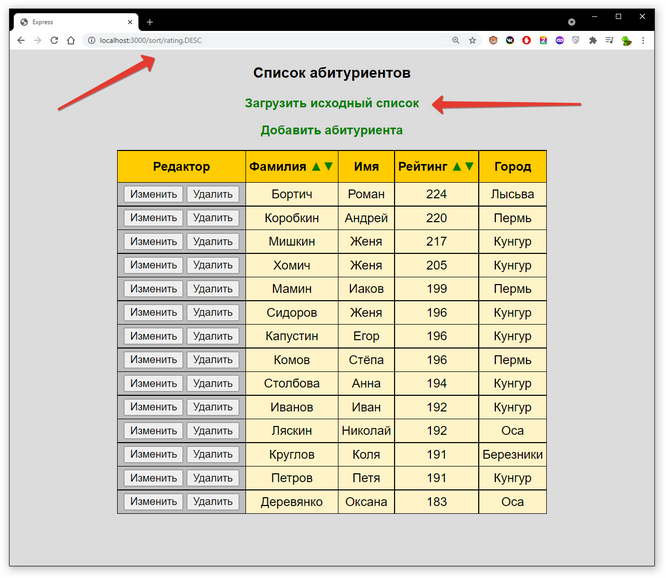

# MySQL

## ЛАБРАБ-06 - 10,17.06.21  

*deadline 19.06.21 24:00*  

Тема MySQL  
Часть 3.  
Разработка web-приложения - фреймворк **Express**.  

---  
---  

**Что нужно сделать по этой работе и что сдавать?**  

Нужно будет создать web-приложение для работы с одной таблицей из базы данных.  
Вот тут есть пример этого web-приложения: http://coding.1gb.ru/  

Базу данных **labrab_06** нужно будет создать у себя в аккаунте на pgsha и в ней одну таблицу с данными, потом выполнить web-приложение, как описано в примере:  
[theme-06-MySQL/part5-express/03-express](https://github.com/permCoding/se-21/tree/main/theme-06-MySQL/part5-express/03-express)  

Вся теория изложена [тут](https://github.com/permCoding/se-21/tree/main/theme-06-MySQL/part5-express)  
И в учебном видео: https://youtu.be/i7ndoX8dkcU  

---  

В вашем аккаунте на pgsha.ru для проверки должна остаться база данных **labrab_06** с таблицей.  

И в свой репозиторий загрузите все части web-приложения (app.js, папку views с файлами hbs, папку css с файлом style.css).  

Важно: в этой лабораторке web-приложение будет работать только с одной таблицей из базы данных - собственно содержание данных в таблице вы должны выбрать сами - это могут быть компьютерные игры, сериалы, спортивные мероприятия и т.п.  
Требования:  
- должно быть 3-6 столбцов в таблице (это кроме столбца id);  
- назначена сортировка по возрастанию/убыванию хотя бы по одному столбцу;  
- должен быть реализован функционал Добавления, Удаления, Изменения записей в таблице - как показано в примере **theme-06-MySQL/part5-express/03-express**.  

Попробуйте самостоятельно добавить возможность вернуть данные в исходное состояние (после удалений, добавлений и исправлений пользователем).  
Рекомендую использовать pool соединений, а открыть одно и последовательно (через промисы) реализовать три действия Удаление содержимого таблицы, Добавление записей (как было), рендеринг веб-странички с таблицей.  
За основу можете взять пример [15-tried.js из part2-SQL](https://github.com/permCoding/se-21/tree/main/theme-06-MySQL/part2-SQL#15-triedjs)  

Вот тут можно посмотреть как будет работать web-приложение: http://coding.1gb.ru/  
  
Примерный внешний вид итогового приложения после нажания на клавишу сортировки вниз по рейтингу:  
  


```

```  

