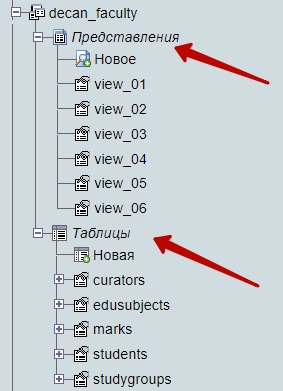

# MySQL

## ЛАБРАБ-05 - xx,xx.04.21  

_deadline xx.05.21 24:00_  

Тема MySQL  
Часть 2.  
Обработка данных связанных таблиц средствами **SQL**.  

Для выполнения этой работы пригодится материал, изложенный в директории [part4-views](../../theme-06-MySQL/part4-views/).  

Основная Ваша задача в рамках этой лабораторки - получить опыт работы с данными в связанных таблицах реляционной базы данных.  

Вот тут справочник по SQL: http://old.code.mu/sql/  
Во всех запросах будет использоваться только команда SELECT с некоторыми дополнительными инструкциями или функциями из этого списка: ROUND, AVG, AS, FROM, JOIN, ON, GROUP BY, HAVING, ORDER BY, CONCAT_WS, ASC/DESC.  

---  

Составить сложный запрос к связанным таблицам, зачастую, бывает довольно сложно. Иногда хочется сначала загрузить на локальный компьютер все данные и потом средствами языка программирования (C#, Python, и т.д.) выбрать необходимые данные и обработать их представление. Однако, такой подход неэффективен и по нагрузке на передачу данных и по скорости реализации, поэтому в рамках данной работы будем тренироваться выполнять запросы именно на стороне сервера и только средствами языка SQL.  

---  

**Что нужно сделать по этой работе и что сдавать?**  

Вам дана схема базы данных:  

  

и [папка с csv-файлами](./csv/).  

Я не даю готовый дамп базы данных, чтобы Вы потренировались настраивать таблицы и связи между ними.  
Данные из csv-файлов нужно будет с помощью импорта загрузить в соответсвующие таблицы, назначить типы данных, первичные и внешние ключи. Потом сделать несколько представлений (VIEW) и сохранить их в самой базе данных в Вашем аккаунте. Представления будут реализовывать запросы к связанным таблицам. Оценка за эту лабораторку выставляется за наличие базы данных, корректную её настройку согласно схемы и наличие в ней представлений с запросами согласно заданий.  

Как создавать представления изложено в директории [part4-views](../../theme-06-MySQL/part4-views/).  

Напоминаю, что для того чтобы создать представление в базе данных достаточно просто перед текстом SQL-запроса SELECT добавить строчку на создание представления, примерно так:  

```SQL
CREATE VIEW users_sorted AS 
SELECT * FROM `table_users`
ORDER BY `rating` DESC
LIMIT 100
```

После выполнения такого запроса в базе данных будет создана виртуальная таблица, называемая представлением. С такой таблицей можно работать в дальнейшем: просматривать содержимое, изменять название предствления, удалять его, изменять текст запроса SELECT, использовать предствление в дизайнере, использовать предствление в других запросах, обращаясь к нему как к обычной таблице.  

```txt

```

### Задания для самостоятельного исполнения  

---  

### task_00  

В своём аккаунте на pgsha.ru создайте для этой лабораторки базу данных **'soft00XX_labrab05'** (где XX - это ваш индивидуальный номер)  
Из папки csv заберите все csv-файлы и из них сделайте из этих данных соответсвующие таблицы в базе данных.  
Настройте корректные типы данных, первичные и индексные столбцы и внешние ключи.  

> Перечислим названия таблиц и их назначение:  
> curators - кураторы учебных групп  
> edusubjects - названия изучаемых учебных дисциплин  
> marks - оценки студентов по разным учебным дисциплинам  
> students - студенты (Имя, Фамилия, принадлежность к учебной группе)  
> studygroups - названия учебных групп  

В дизайнере настройте схему базы данных со связями по аналогии с той, что приведена выше (чтобы выглядела аккуратно, желательно без пересечений отношений между таблицами, не забудьте её сохранить, там же в меню дизайнера, можно дать имя scheme).  

> Далее все задания выполнять в своём аккаунте  непосредственно в **phpMyAdmin**.  
> Для каждого задания сделать отдельное представление с соответствующим номером, например так: **view_01**.  
> Задания не отсортированы по уровню сложности.  

После выполнения всех заданий ваша база данных в **phpMyAdmin** будет иметь примерно такой вид:  

  

---  

### view_01  

Вывести таблицу с такими тремя столбцами: Название группы | id студента | Фамилия Имя |, отсортировав по названию группы по возрастанию, и по столбцу 'Фамилия Имя' по возрастанию, например, так:  
nameGroup | id | fullName  
----------|----|----------
ПИб-1 | 4 | Бобко Борис  
ПИб-1 | 1 | Иванов Иван  
ПИб-1 | 6 | Мишкин Миша  
ПИнб-2 | 3 | Сидоров Сидор  
ПИнб-3 | 8 | Абрамов Яков  
ПИнб-3 | 2 | Петров Петр  
ПИнб-4 | 7 | Клопова Клементина  
ПИнб-4 | 5 | Хомкин Игорь  

---  

### view_02  

Вывести id и Фамилии всех студентов для куратора 'Дуров', отсортировав по Фамилии по возрастанию, например, так:  
id | lastName
---|---------
4 | Бобко  
1 | Иванов  
6 | Мишкин  

---  

### view_03  

Вывести таблицу со столбцами 'id' и 'Фамилия Имя' для студентов из всех существующих учебных групп, которые по предмету 'ООП' имеют оценку '5', например, так:  
id|fullName
--|--------
4 |Бобко Борис
5 |Хомкин Игорь
10|Пирожков Антон

---  

### view_04  

Вывести Ведомость Экзамена группы 'ПИнб-2' по предмету 'ООП', то есть таблицу студентов (включая их 'id') из группы 'ПИнб-2' с оценками за предмет 'ООП', отсортировав по Фамилии по возрастанию, например, так:  

id| lastName | mark |  
--|----------|-----:|  
12| Агузарова | 4
9 | Иванюк | 4
11 | Карпов | 3
10 | Пирожков | 5
3 | Сидоров | 3

---  

### view_05  

Вывести пять лучших студентов по среднему баллу по всем предметам, отсортировав их по среднему балу по убыванию, и средний балл окрулить до двух знаков, например, так:  

lastName | avg_mark
---------|--------:
Пирожков | 5.00
Хомкин | 4.50
Бобко | 4.33
Агузарова | 4.00
Абрамов | 4.00

---  

### view_06  

Вывести Фамилию и средний балл студентов, у которых средний балл ниже 4.00, отсортировав их по убыванию по среднему баллу, например, так:  

lastName | avg_mark
---------|---------
Петров | 3.50
Мишкин | 3.33
Сидоров | 3.00
Карпов | 3.00
Клопова | 2.80

---  

```txt

```
